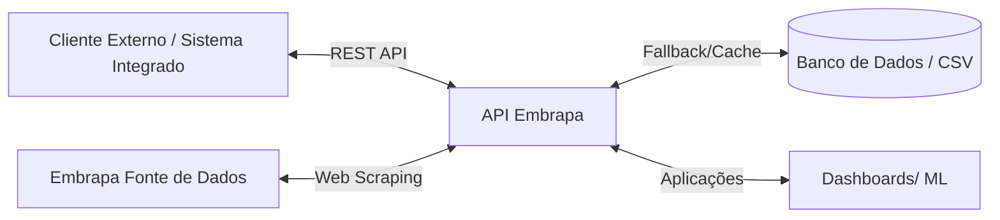
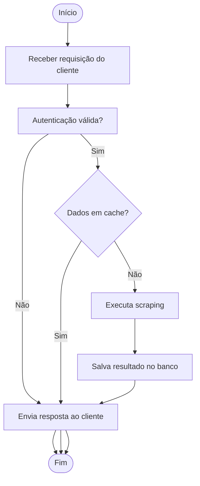
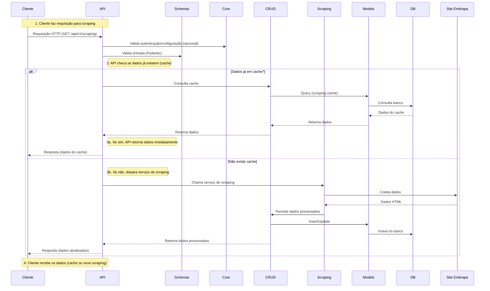
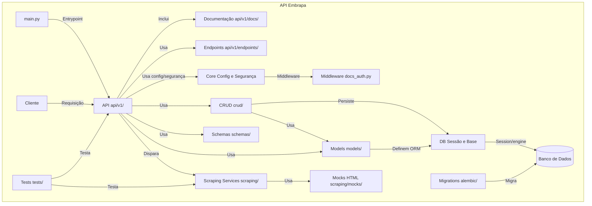
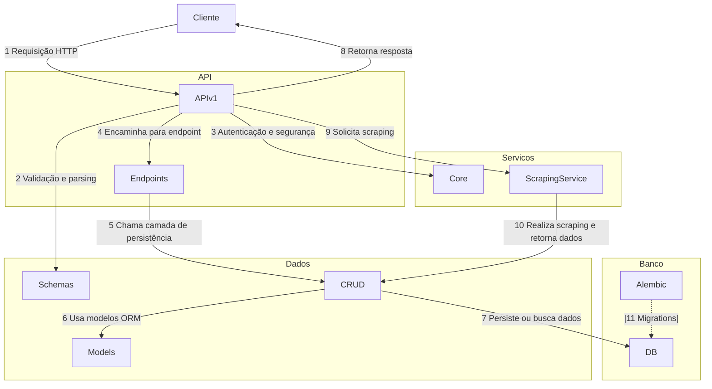
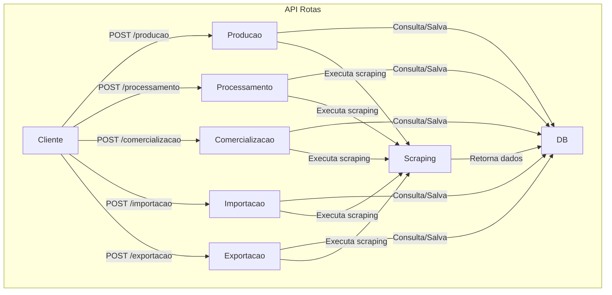

# 🚀 API Embrapa Uva e Vinho - POS Tech MLE

API para coleta estruturada de dados públicos da **Embrapa Uva e Vinho**, nas abas:

- 🍇 Produção
- 🍷 Processamento
- 💰 Comercialização
- 🌎 Importação
- 🚢 Exportação

Esses dados servirão de base para análise e construção de modelos de **Machine Learning** no futuro.

---

## 🌐 Links Rápidos

- [API em produção (Swagger UI)](https://tech-challenge-embrapa-1.onrender.com/docs#/)
- [Repositório no GitHub](https://github.com/Isabelle-Fideles/tech-challenge-embrapa/tree/main/fase1)
- [Vídeo de apresentação](https://www.youtube.com/watch?v=GpOifVpCjZE)

---

## 📝 Como a API Resolve o Problema de Acesso aos Dados da Vitibrasil

Atualmente, os dados públicos sobre `produção`, `processamento`, `comercialização`, `importação` e `exportação` de uvas e vinhos estão disponíveis no site Vitibrasil, mantido pela Embrapa Uva e Vinho.
**Porém, o site apresenta limitações importantes:**
- Não existe API oficial para consulta automática ou integração.
- O acesso é apenas manual, via navegação web e download de arquivos.
- O site sofre instabilidades e pode ficar fora do ar, dificultando análises e integrações em tempo real.

**Nossa API resolve esse problema ao:**
- Estruturar e padronizar o acesso aos dados da Embrapa via endpoints RESTful.
- Implementar um sistema de fallback/cache local, garantindo disponibilidade mesmo em caso de instabilidade da fonte.
- Facilitar a integração dos dados com dashboards, sistemas de BI e projetos de Machine Learning.

Assim, o projeto transforma dados antes pouco acessíveis e voláteis em uma base confiável, pronta para consumo por aplicações modernas.

---

## 🔗 Sumário
- [🛠️ Tecnologias](#-tecnologias)
- [🗂️ Estrutura do Projeto](#-estrutura-do-projeto)
- [📈 Diagramas do Projeto](#-diagramas-do-projeto)
- [🗺️ Fluxo Detalhado da API](#-fluxo-detalhado-da-api)
- [⚙️ Instalação e Execução](#-instalação-e-execução)
- [🔐 Autenticação](#-autenticação)
- [🧪 Testes](#-testes)
- [🔁 Fluxo de Funcionamento](#-fluxo-de-funcionamento)
- [⭐ Diferenciais e Boas Práticas](#-diferenciais-e-boas-práticas)
- [📊 Machine Learning](#-cenário-de-aplicação-em-machine-learning)
- [🚀 Deploy (MVP)](#-plano-de-deploy-mvp)
- [🔗 Rotas](#-rotas-disponíveis)
- [📄 Licença](#-licença)

---

## 🛠️ Tecnologias
- Python 3.12
- FastAPI
- SQLAlchemy
- **SQLite** (utilizado na Fase 1, pela facilidade de configuração e aderência ao escopo do MVP)
- Alembic
- BeautifulSoup4

> ⚠️ **Observação:**  
> O uso do SQLite foi uma decisão estratégica para acelerar o desenvolvimento e simplificar testes na Fase 1 do projeto.  
> **Nas próximas fases**, o projeto está preparado para utilizar bancos de dados relacionais mais robustos (PostgreSQL, MariaDB, etc.), já integrados como serviços em containers (Docker), atendendo a requisitos de escalabilidade, concorrência e produção.

---

## 🗂️ Estrutura do Projeto

Estrutura modular baseada em boas práticas de FastAPI e princípios de Clean Architecture:

- Separação clara por camadas (`api/`, `core/`, `models/`, `schemas/`, `crud/`)
- Roteamento versionado (`/api/v1/...`)

```
📦 API Embrapa - POS Tech MLE
├── 📁 app
│   ├── 📁 alembic                 # Migrations do banco de dados
│   │   └── __init__.py
│   ├── 📁 api                     # Camada de API
│   │   └── 📁 v1                  # Versão da API
│   │       ├── api.py             # Roteador principal
│   │       ├── 📁 docs            # Documentação e responses
│   │       │   ├── embrapa.py
│   │       │   └── responses.py
│   │       ├── 📁 endpoints       # Endpoints da API
│   │       │   ├── __init__.py
│   │       │   └── scraping.py
│   │       └── __init__.py
│   ├── 📁 core                    # Configurações e segurança
│   │   ├── exceptions.py
│   │   ├── __init__.py
│   │   ├── 📁 middleware
│   │   │   └── docs_auth.py        # Proteção da doc Swagger
│   │   └── security.py             # JWT, OAuth2, HTTPBasic, etc.
│   ├── 📁 crud                     # Camada de persistência
│   │   ├── __init__.py
│   │   └── scraping.py
│   ├── 📁 db                       # Sessão e base SQLAlchemy
│   │   ├── base.py
│   │   ├── __init__.py
│   │   └── session.py
│   ├── 📁 models                   # Modelos ORM
│   │   ├── __init__.py
│   │   └── scraping.py
│   ├── 📁 schemas                  # Modelos Pydantic
│   │   ├── __init__.py
│   │   └── scraping.py
│   ├── 📁 scraping                 # Módulos de scraping
│   │   ├── bs4_scraper.py          # Serviço genérico
│   │   ├── exportacao.py           # Customizações específicas
│   │   ├── importacao.py
│   │   ├── __init__.py
│   │   └── 📁 mocks                # Mocks HTML locais
│   │       ├── opt_02.html
│   │       ├── opt_03.html
│   │       ├── opt_04.html
│   │       ├── opt_05.html
│   │       └── opt_06.html
│   └── 📁 tests                    # Testes automatizados
│       └── __init__.py
|       └── test_scraping.py
|
├── 🚀 main.py                      # Ponto de entrada da aplicação
├── ⚙️ create_db.py                 # Script para criação inicial do banco
├── 🗃️ embrapa.db                   # Banco SQLite
├── 📄 poetry.lock                  # Lockfile de dependências
├── 📄 pyproject.toml               # Configuração do projeto (Poetry)
├── 📄 requirements.txt             # Alternativa ao Poetry
├── 📄 README.md                    # Documentação do projeto
```
---

## 📈 Diagramas do Projeto
Esta seção reúne os principais diagramas do projeto — **arquitetura macro**, **sequência**, **componentes**, **fluxos de alto nível**, **fluxos detalhados** e **rotas** — que ilustram a arquitetura, funcionamento interno e endpoints da API Embrapa Uva e Vinho.  
Esses diagramas são essenciais para onboarding de novos desenvolvedores, manutenção evolutiva e consulta técnica rápida.


> ⚠️ Observação: Se você tiver problemas para visualizar os diagramas em Mermaid no GitHub, acesse a versão em imagem (PNG) disponível nos links abaixo de cada diagrama.  
> Usuários do VS Code com suporte ao Mermaid podem visualizar normalmente em markdown.


### 🔹 1. **Diagrama de arquitetura macro**

[🖼️ Ver diagrama em PNG](app/docs/diagramas/arquitetura_macro.png)

### 🔹 2. **Diagrama fluxos de alto nível**

[🖼️ Ver diagrama em PNG](app/docs/diagramas/fluxos_auto_nivel.png)


### 🔹 3. **Diagrama de sequência**

[🖼️ Ver diagrama em PNG](app/docs/diagramas/sequencia.png)

### 🔹 4. **Diagrama de componentes**

[🖼️ Ver diagrama em PNG](app/docs/diagramas/componentes.png)


### 🔹 5. **Diagrama fluxos detalhados**

[🖼️ Ver diagrama em PNG](app/docs/diagramas/fluxos_detalhe.png)

### 🔹 6. **Diagrama de rotas**

[🖼️ Ver diagrama em PNG](app/docs/diagramas/rotas.png)


### 🗺️ Fluxo Detalhado da API

| Etapa | Descrição                                        | Arquivo                            |
| :---- | :----------------------------------------------- | :--------------------------------- |
| 1     | API recebe requisição                            | `app/main.py`                      |
| 2     | Requisição roteada pela API v1                   | `app/api/v1/api.py`                |
| 3     | Endpoint `embrapa_producao()` ou outro é chamado | `app/api/v1/endpoints/scraping.py` |
| 4     | Serviço de scraping é ativado                    | `app/scraping/bs4_scraper.py`      |
| 5     | Parser executado com BeautifulSoup               | `app/scraping/bs4_scraper.py`      |
| 6     | Verifica se dados existem no banco               | `app/crud/scraping.py`             |
| 7     | Se não existir, salva dados no banco             | `app/crud/scraping.py`             |
| 8     | Formata dados com Pydantic                       | `app/schemas/scraping.py`          |
| 9     | Resposta JSON enviada ao cliente                 | `-`                            |


---

## ⚙️ Instalação e Execução

### ✅ **Opção 1: Rodar localmente com Poetry**

```bash
git clone https://github.com/Isabelle-Fideles/tech-challenge-embrapa.git
cd tech-challenge-embrapa/fase1
poetry install
poetry shell
uvicorn app.main:app --reload --port 8000
```

### ✅ **Opção 2: Rodar com Docker**

```bash
git clone https://github.com/Isabelle-Fideles/tech-challenge-embrapa.git
cd tech-challenge-embrapa/fase1
docker compose up -d --build
```
Depois, acesse:
- ➡️ http://localhost:8000 → API funcionando.
- ➡️ http://localhost:8000/docs → Swagger UI.

#### ✅ **Para parar:**

```bash
docker compose down
```

#### ✅ **Outros comandos úteis::**

- Ver logs:
```bash
docker compose logs -f api
```
- Limpar imagens/parar containers:
```bash
docker system prune -af --volumes
```
---

## 🔐 Autenticação
Autenticação via **HTTPBasic** foi implementada (FASE 1) como proteção opcional da documentação (Swagger):
- Middleware: app/core/middleware/docs_auth.py (**DESABILITADO**)
- Rota protegida: /docs (**HABILITADO**)

---

## 🔑 Credenciais de Acesso (Demo)

Para acessar a documentação Swagger ou utilizar os endpoints protegidos, utilize as seguintes credenciais de teste:

- **Usuário:** `admin`
- **Senha:** `!@#$Fiap2025`

***Essas credenciais são exclusivas para avaliação e uso em ambiente de testes.***
> ⚠️ **Importante:** Não utilize estas credenciais em produção.

---

## 🧪 Testes

#### ✅ Como executar os testes

Execute na raiz do projeto:

```bash
PYTHONPATH=. pytest app/tests -v
```

Ou, alternativamente:

```bash
python -m pytest app/tests -v
```


#### ✅ Pré-requisitos

- Dependências instaladas (`poetry install` ou `pip install -r requirements.txt`)
- Estar na raiz do projeto (`/fase1` ou similar)
- Ter os arquivos de mock HTML na pasta:

```
app/scraping/mocks/
├── opt_02.html
├── opt_03.html
├── opt_04.html
├── opt_05.html
└── opt_06.html
```


#### ✅ O que é testado

- 🔗 **`build_embrapa_url`** — Construção correta das URLs da Embrapa.
- 🌐 **`fetch_page_content`** — Download de conteúdo HTML, com tratamento de falhas simuladas (timeouts, erros de conexão, indisponibilidade).
- 📄 **`parse_table`** e **`parse_import_export_table`** — Parsing de HTML para JSON estruturado.
- 🔥 **`scrape_embrapa`** — Scraping completo, verificando se dados existem, salvamento e resposta formatada.
- ⚠️ **Exceções** — Tratamento de erros como `ExternalServiceUnavailableException` e `EmbrapaDataNotFoundException`.


#### 🚩 Observações importantes

Se ocorrer o erro:

```plaintext
ModuleNotFoundError: No module named 'app'
```

Garanta que você está executando com o parâmetro:

```bash
PYTHONPATH=. pytest app/tests
```

Ou usando o modo módulo:

```bash
python -m pytest app/tests
```

Isso é necessário porque o Python precisa reconhecer o diretório `app/` como parte do caminho de importação.


#### 🧠 Organização dos testes

```
app/tests/
└── test_scraping.py
```


#### 🏆 Exemplo de saída esperada

```plaintext
================================= test session starts ===============================
collected 12 items

app/tests/test_scraping.py ............                                       [100%]

============================== 12 passed in 0.42s ==============================
```


#### 🚩 Dicas profissionais

- ✅ Recomenda-se rodar os testes sempre antes de qualquer commit.
- ✅ Para automação, considere incluir no pipeline de CI/CD (`GitHub Actions`, `GitLab CI`, `Render`, etc.).

---

## ⭐ Diferenciais e Boas Práticas

- Fallback automático para cache local caso o site da Embrapa esteja fora do ar, garantindo alta disponibilidade da API.
- Projeto altamente modularizado, facilitando manutenção, testes e expansão.
- Autenticação básica implementada para documentação via Swagger.
- Documentação completa: Swagger UI, diagramas em Mermaid e PNG.
- Pronto para integração futura com dashboards (ex: Power BI, Streamlit) e projetos de Machine Learning.
- Uso de variáveis sensíveis centralizadas em `.env` (python-dotenv), aumentando a segurança.
- Commits claros e organizados, seguindo boas práticas de versionamento.
- Filtros nos endpoints, evitando sobrecarga de dados e melhorando performance.
- Testes automatizados cobrindo scraping, parsing e tratamento de exceções.

## ⚡ Otimização e Índices no Banco de Dados

Todas as tabelas do projeto possuem índices explícitos nas colunas mais consultadas, conforme recomendado em boas práticas.  
Foram criados índices em:

- **ano**
- **opcao**
- **subopcao** (quando aplicável)
- **id** (chave primária, índice automático)

Esses índices garantem alta performance nas consultas realizadas pela API, principalmente nos filtros por ano, tipo de dado (opcao) e categoria (subopcao).  
A modelagem foi pensada para suportar um grande volume de dados sem perda de eficiência.

---

## 📊 Cenário de Aplicação em Machine Learning
Os dados coletados poderão ser utilizados para:
- **Predição de produção de uvas por estado**
- **Classificação de tipos de vinho por perfil de exportação**
- **Análise de tendências na comercialização e importação**

---

## 🚀 Plano de Deploy (MVP)

O projeto pode ser facilmente publicado em:

- Railway (deploy contínuo via Git)
- Render.com
- **Docker + Uvicorn em VPS (Ex: EC2)**

---

## 🔗 Rotas disponíveis

- /api/v1/embrapa/producao
- /api/v1/embrapa/processamento
- /api/v1/embrapa/comercializacao
- /api/v1/embrapa/importacao
- /api/v1/embrapa/exportacao

## 📄 Licença
MIT License.
