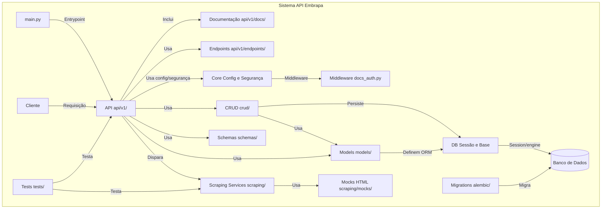

```mermaid
flowchart TD
    subgraph Sistema API Embrapa
        MainPy[main.py]
        Alembic[Migrations alembic/]
        API[API api/v1/]
        Docs[Documentação api/v1/docs/]
        Endpoints[Endpoints api/v1/endpoints/]
        Core[Core Config e Segurança]
        Middleware[Middleware docs_auth.py]
        CRUD[CRUD crud/]
        DB[DB Sessão e Base]
        Models[Models models/]
        Schemas[Schemas schemas/]
        ScrapingService[Scraping Services scraping/]
        Mocks[Mocks HTML scraping/mocks/]
        Tests[Tests tests/]
        Cliente[Cliente]
        DBStorage[(Banco de Dados)]
    end


    Cliente -->|Requisição| API
    MainPy -->|Entrypoint| API
    API -->|Inclui| Docs
    API -->|Usa| Endpoints
    API -->|Usa config/segurança| Core
    Core -->|Middleware| Middleware
    API -->|Usa| CRUD
    API -->|Usa| Schemas
    API -->|Usa| Models
    API -->|Dispara| ScrapingService
    ScrapingService -->|Usa| Mocks
    CRUD -->|Persiste| DB
    CRUD -->|Usa| Models
    Models -->|Definem ORM| DB
    DB -->|Session/engine| DBStorage
    Tests -->|Testa| API
    Tests -->|Testa| ScrapingService
    Alembic -->|Migra| DBStorage
```