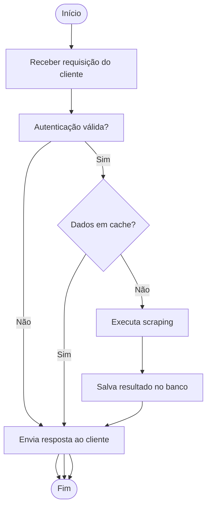
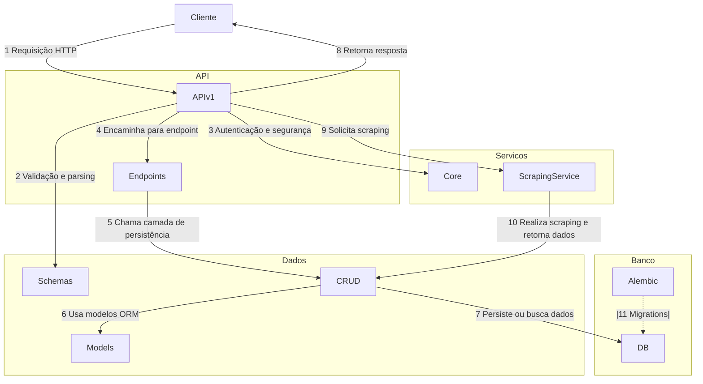

```mermaid
flowchart TD
    Start([Início])
    Req[Receber requisição do cliente]
    Auth[Autenticação válida?]
    Cache{Dados em cache?}
    Scraping[Executa scraping]
    Salva[Salva resultado no banco]
    Responde[Envia resposta ao cliente]
    Fim([Fim])

    Start --> Req --> Auth
    Auth -- Não --> Responde --> Fim
    Auth -- Sim --> Cache
    Cache -- Sim --> Responde --> Fim
    Cache -- Não --> Scraping --> Salva --> Responde --> Fim
```

```mermaid
flowchart TD
    Cliente -->|1 Requisição HTTP| APIv1
    APIv1 -->|2 Validação e parsing| Schemas
    APIv1 -->|3 Autenticação e segurança| Core
    APIv1 -->|4 Encaminha para endpoint| Endpoints
    Endpoints -->|5 Chama camada de persistência| CRUD
    CRUD -->|6 Usa modelos ORM| Models
    CRUD -->|7 Persiste ou busca dados| DB
    APIv1 -->|8 Retorna resposta| Cliente
    APIv1 -->|9 Solicita scraping| ScrapingService
    ScrapingService -->|10 Realiza scraping e retorna dados| CRUD
    Alembic -. |11 Migrations| .-> DB

    subgraph API
        APIv1
        Endpoints
    end

    subgraph Banco
        DB
        Alembic
    end

    subgraph Dados
        Models
        Schemas
        CRUD
    end

    subgraph Servicos
        ScrapingService
        Core
    end
```