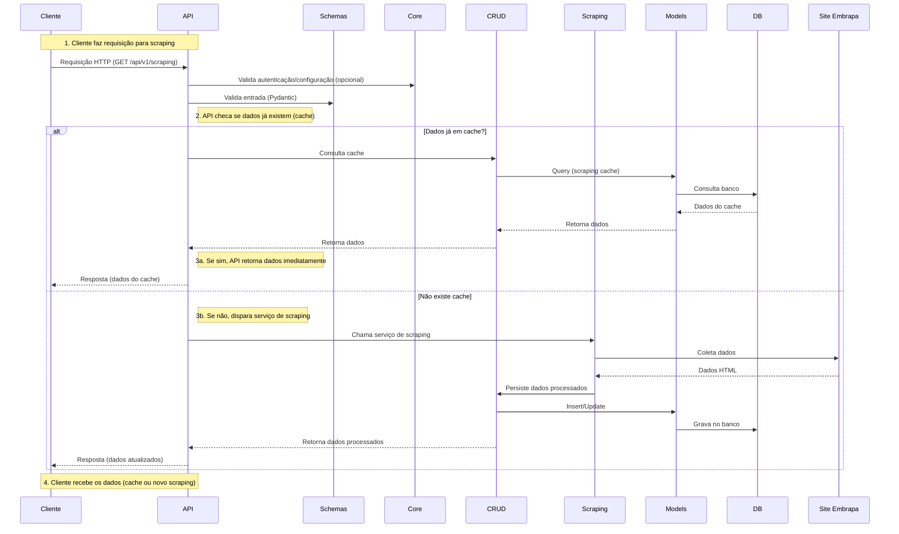

```mermaid
sequenceDiagram
    participant Cliente
    participant API
    participant Schemas
    participant Core
    participant CRUD
    participant Scraping
    participant Models
    participant DB

    Note over Cliente,API: 1. Cliente faz requisição para scraping

    Cliente->>API: Requisição HTTP (GET /api/v1/scraping)
    API->>Core: Valida autenticação/configuração (opcional)
    API->>Schemas: Valida entrada (Pydantic)

    Note right of API: 2. API checa se dados já existem (cache)
    alt Dados já em cache?
        API->>CRUD: Consulta cache
        CRUD->>Models: Query (scraping cache)
        Models->>DB: Consulta banco
        DB-->>Models: Dados do cache
        Models-->>CRUD: Retorna dados
        CRUD-->>API: Retorna dados
        Note right of API: 3a. Se sim, API retorna dados imediatamente
        API-->>Cliente: Resposta (dados do cache)
    else Não existe cache
        Note right of API: 3b. Se não, dispara serviço de scraping
        API->>Scraping: Chama serviço de scraping
        Scraping->>Site Embrapa: Coleta dados
        Site Embrapa-->>Scraping: Dados HTML
        Scraping->>CRUD: Persiste dados processados
        CRUD->>Models: Insert/Update
        Models->>DB: Grava no banco
        CRUD-->>API: Retorna dados processados
        API-->>Cliente: Resposta (dados atualizados)
    end

    Note over Cliente,API: 4. Cliente recebe os dados (cache ou novo scraping)

```